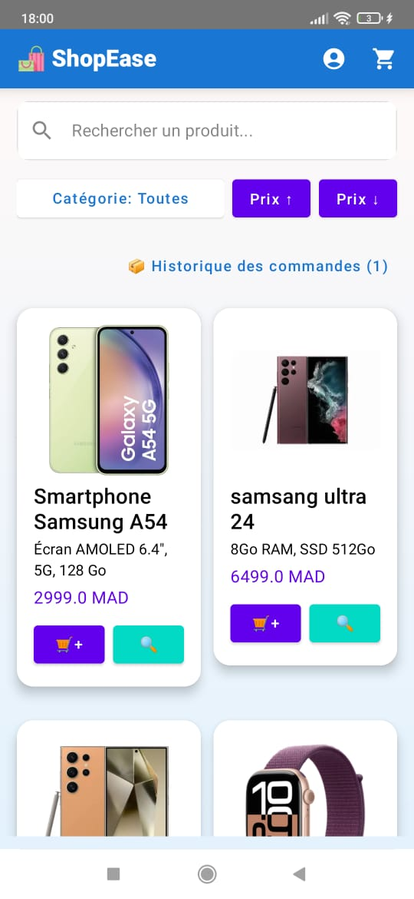
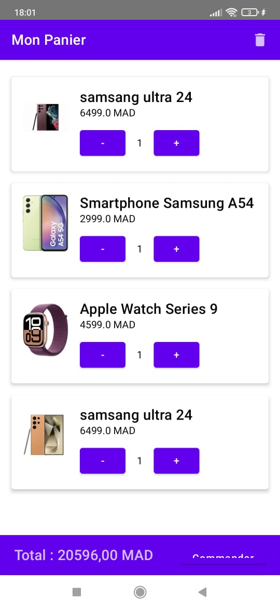
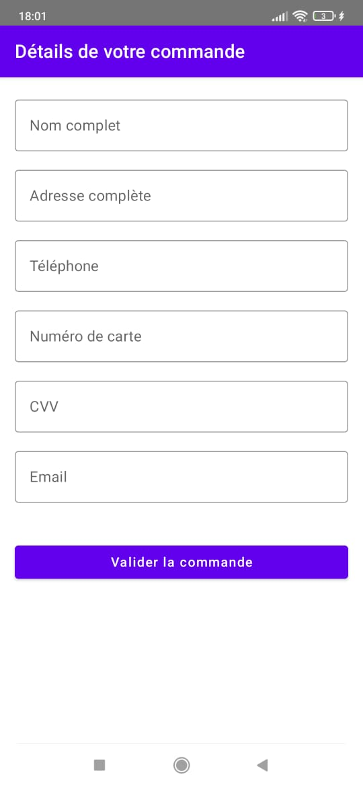
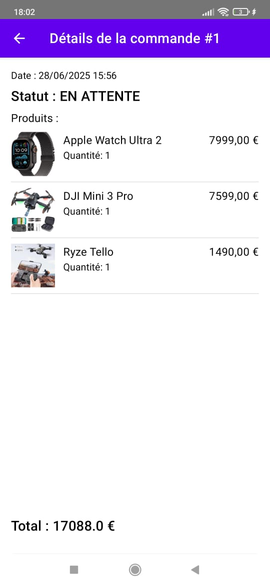

# 🛍️ EcommerceApp – Application Mobile Android

> Projet de Fin de Module – Développement Mobile  
Université Abdelmalek Essaâdi – Master DevOps & Cloud Computing  
Réalisé par : **Mohammed El Khaiari**

---

## 📱 Présentation

**EcommerceApp** est une application mobile e-commerce développée en **Kotlin** avec **Jetpack Compose**, permettant de :
- Consulter un catalogue de produits
- Ajouter des produits au panier
- Passer une commande avec reçu
- Suivre ses commandes passées
- Gérer la session utilisateur

---

## 🧱 Architecture du projet

L'application suit l’architecture **MVVM** avec une séparation claire en packages :

com.example.ecommerceapp/
├── data/
│ ├── local/dao, entity, db
│ ├── repository/
│ └── SessionManager.kt
├── domain/ → Modèles (Product, Order)
├── presentation/ → UI (home, cart, auth, etc.)
├── viewmodel/ → ViewModels (Product, Cart, Order)
├── utils/ → Chargement JSON, screen helpers
├── ui/theme/ → Styles et couleurs
├── Navigation.kt, MainActivity.kt
└── assets/products.json

---

## 🔧 Technologies utilisées

| Composant         | Outils                     |
|------------------|---------------------------|
| Langage          | Kotlin                    |
| UI               | Jetpack Compose           |
| Persistance      | Room                      |
| Données          | Fichier JSON (local)      |
| Architecture     | MVVM                      |
| Navigation       | Navigation Compose        |
| Autres           | Coroutines, ViewModel, LiveData

---

## 📦 Fonctionnalités développées

- 🔐 Authentification (login/register)
- 🏠 Accueil avec liste des produits
- 📄 Détail produit
- 🧺 Panier avec ajout, suppression, total dynamique
- 💳 Checkout avec formulaire et reçu
- 📜 Historique des commandes avec statut
- 🌐 Interface responsive (smartphone, tablette)
- 📁 JSON et images locales (aucun backend)

---

## 📸 Captures d’écran

### login

### Accueil

### Panier

### Checkout

### Historique des commandes

---
## 🧪 Dépendances a ajouter 

kotlin
// Jetpack Compose
implementation("androidx.compose.ui:ui")
implementation("androidx.compose.material:material")
implementation("androidx.navigation:navigation-compose")
implementation("androidx.lifecycle:lifecycle-viewmodel-compose")

// Room
implementation("androidx.room:room-runtime")
kapt("androidx.room:room-compiler")

// JSON / Parsing
implementation("com.google.code.gson:gson")

// Kotlin coroutines
implementation("org.jetbrains.kotlinx:kotlinx-coroutines-core")
implementation("org.jetbrains.kotlinx:kotlinx-coroutines-android")

